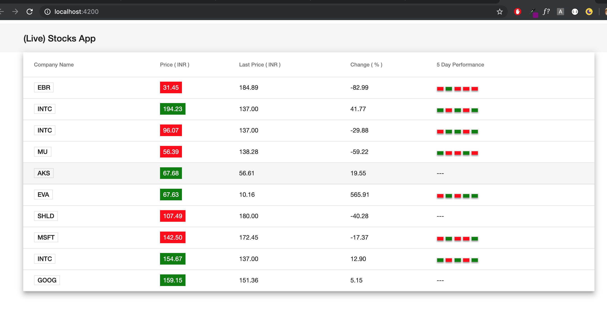
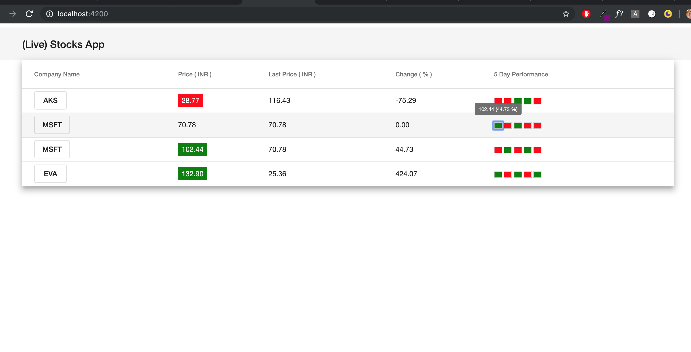
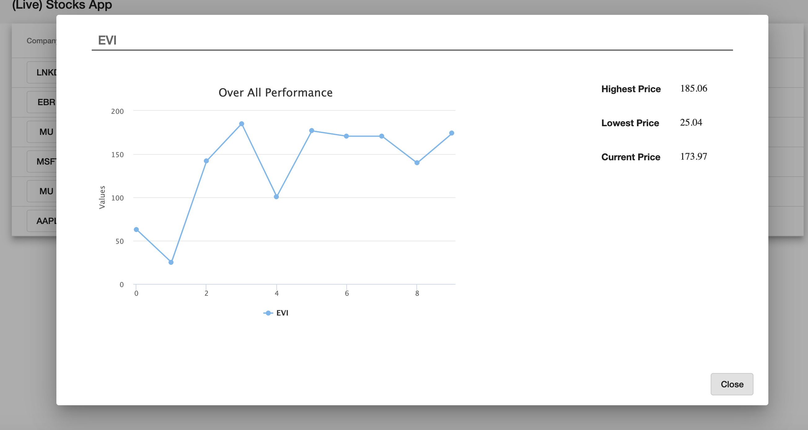

# LiveStockApp

This project was generated with [Angular CLI](https://github.com/angular/angular-cli) version 7.3.3.
And is published at `https://annukampa.github.io/liveStockApp/` via github pages.

## Development server

1. Clone the project liveStockApp. 
2. Your system should have angular , npm and node.js installed.
3. Now after cloning the project install the dependencies via command npm install.
4. Run `ng serve ` for a dev server. Navigate to `http://localhost:4200/`. 
5. Or add  '--open' with 'ng serve' as here : 'ng serve --open' , this will open the app directly in the browser on this location `http://localhost:4200/`.
6. The app will automatically reload if you change any of the source files.

## App demo

The app looks like : 

The column 5 Day Performance shows the comparison of last 5 days , along with their % change which can be viewed on hover the colored blocks.
The red colored block depicts there has been a decline in price as compared to the previous day.
While the green colored block depicts there has been an increase in price as compared to the previous day.

One can click a table row to view the detail : 

